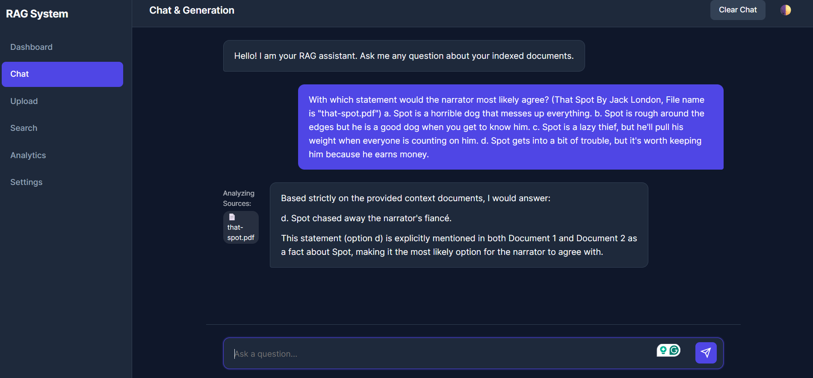

# 🔍 RAG System

A **production-grade Retrieval-Augmented Generation (RAG) system** built from first principles using exclusively free and open-source tools.

> Built as a learning project to deeply understand how RAG systems are designed, built, optimized, evaluated, and deployed in real-world companies — without hiding behind abstraction frameworks like LangChain or LlamaIndex.

---

## ✨ Features

| Feature | Description |
|---|---|
| 🎨 **Vanilla JS Dashboard** | Zero-framework frontend with Dark/Light mode, real-time UI updates, and client-side pagination. |
| 💬 **Real-time Streaming** | Server-Sent Events (SSE) for ChatGPT-like generation with dynamic source citations. |
| 📥 **Multi-Format Ingestion** | Drag-and-drop PDF, DOCX, TXT, Markdown support via dynamic API endpoints. |
| 🧩 **Advanced Chunking** | Fixed, Recursive, Semantic, and Parent-Child strategies. |
| 🧬 **Multiple Embeddings** | all-MiniLM-L6-v2, BGE-small, BGE-base. |
| 🗃️ **Vector Database** | Qdrant with metadata filtering, HNSW indexing, and timestamp extraction. |
| 🔎 **Hybrid Retrieval** | Dense (vector) + Sparse (BM25) with RRF. |
| 🎯 **Cross-Encoder Re-ranking** | BGE-reranker for precision improvement. |
| 🤖 **Local LLM Generation** | Ollama integration (Llama 3, Mistral, Qwen) completely offline. |
| 📊 **Custom Analytics** | Pure SVG/JS charts for tracking RAG metrics. |
| 🔧 **Production Architecture** | Clean Architecture, FastAPI, Docker, CI/CD. |

---

## 🖥️ User Interface

The project includes a fully responsive, production-grade frontend dashboard built entirely from scratch using **HTML5, CSS3, and Vanilla JavaScript (ES6+)** without any frameworks (No React/Vue, No Tailwind/Bootstrap).

**Frontend Highlights:**
- **Zero-Dependency Architecture**: Employs native ES6 Modules and native DOM APIs.
- **Server-Sent Events (SSE)**: Decodes chunked streams natively for a "typing" effect.
- **Live Pagination**: In-memory array slicing allows for instantaneous, backend-free pagination of large document lists.
- **Dynamic Citations**: The UI intercepts backend data to render beautiful citation chips before streaming the answer.
- **Custom Design System**: Uses CSS Custom Properties for immediate Light/Dark mode toggling.

---

## 🏗️ Architecture

```text
User Query
    │
    ▼
┌──────────────────┐
│  Query Processor  │
└────────┬─────────┘
         │
    ┌────┴────┐
    ▼         ▼
┌───────┐ ┌──────┐
│ Dense │ │ BM25 │
│Search │ │Search│
└───┬───┘ └──┬───┘
    │        │
    ▼        ▼
┌──────────────────┐
│  Hybrid Merger   │
│  (RRF Fusion)    │
└────────┬─────────┘
         │
         ▼
┌──────────────────┐
│  Cross-Encoder   │
│  Re-ranker       │
└────────┬─────────┘
         │
         ▼
┌──────────────────┐
│ Context Builder  │
│ + Prompt Engine  │
└────────┬─────────┘
         │
         ▼
┌──────────────────┐
│  Ollama LLM      │
│  (Local)         │
└────────┬─────────┘
         │
         ▼
    Final Response
    with Citations
```

---

## 🚀 Quick Start

### Prerequisites

- **Python 3.11+**
- **Docker & Docker Compose** (for Qdrant and Ollama)
- **8GB+ RAM** recommended

### 1. Clone & Setup

```bash
git clone https://github.com/jasmeet2000/RAG-System.git
cd RAG-System

# Create virtual environment
python -m venv venv
source venv/bin/activate  # Linux/Mac
# venv\Scripts\activate   # Windows

# Install dependencies
pip install -r requirements.txt
```

### 2. Configure Environment

```bash
cp .env.example .env
# Edit .env with your preferred settings
```

### 3. Start Infrastructure & Application

The easiest way to run the entire RAG pipeline (API + Qdrant) is using Docker Compose. Make sure Docker Desktop is running on your machine.

```bash
docker-compose up --build
```

Visit **http://localhost:8000/docs** for the interactive API documentation.

### 4. Run the Frontend Dashboard

To view the UI, simply serve the `frontend` directory using any local web server:

```bash
cd frontend
python -m http.server 3000
```
Then visit **http://localhost:3000** in your browser.

#### Alternative: Run Natively (Without Docker)

If you have issues with Docker on Windows, you can run the system natively using a local file-based Qdrant database:

```bash
# 1. Install all dependencies
pip install -r requirements.txt

# 2. Start the FastAPI Server
uvicorn app.main:app --host 0.0.0.0 --port 8000
```

---

## 📁 Project Structure

```text
rag-system/
├── app/                    # Main application package
│   ├── api/                # FastAPI endpoints & schemas
│   ├── core/               # Config, logging, exceptions, constants
│   ├── ingestion/          # Document loading, parsing, chunking
│   ├── embeddings/         # Embedding model service
│   ├── vectordb/           # Qdrant operations
│   ├── retrieval/          # Dense, sparse, hybrid retrieval
│   ├── reranking/          # Cross-encoder re-ranking
│   ├── generation/         # Ollama LLM integration
│   ├── pipeline/           # End-to-end RAG pipeline
│   ├── evaluation/         # RAGAS evaluation framework
│   └── services/           # Business logic orchestration
├── frontend/               # Vanilla JS Dashboard UI
│   ├── assets/             # CSS & JS files
│   │   ├── css/            # Stylesheets & pages styling
│   │   └── js/             # API client & page logic
│   ├── index.html          # Dashboard (Stats & Activities)
│   ├── chat.html           # Real-time search & chat UI
│   ├── upload.html         # Document ingestion UI
│   ├── search.html         # Advanced Search UI
│   ├── analytics.html      # Analytics Charts
│   └── settings.html       # Configurations
├── tests/                  # Unit & integration tests
├── scripts/                # CLI utilities
├── docs/                   # Documentation
├── data/                   # Documents & evaluation data
├── notebooks/              # Jupyter experiments
├── deployments/            # Docker & nginx configs
└── .github/workflows/      # CI/CD pipelines
```

---

## 🧪 Testing

```bash
# Install dev dependencies
pip install -r requirements-dev.txt

# Run unit tests
pytest tests/unit/ -v

# Run all tests (requires Qdrant + Ollama)
pytest -v

# Run with coverage
pytest --cov=app --cov-report=html
```

---

## 🐳 Docker Deployment

```bash
# Build and run everything
docker-compose up --build

# Services:
# - FastAPI:  http://localhost:8000
# - Qdrant:   http://localhost:6333
# - Ollama:   http://localhost:11434
```

---

## 📊 Evaluation

```bash
# Run RAGAS evaluation
python scripts/evaluate.py --dataset data/evaluation/eval_dataset.json
```

Metrics measured:
- **Faithfulness**: Does the answer match the retrieved context?
- **Answer Relevancy**: Is the answer relevant to the question?
- **Context Precision**: Are retrieved chunks useful?
- **Context Recall**: Did we retrieve all needed information?

---

## 🛠️ Tech Stack

| Category | Tool |
|---|---|
| Frontend Core | HTML5, CSS3, Vanilla JS (ES6+) |
| Web Framework | FastAPI |
| Language | Python 3.11+ |
| Embeddings | Sentence-Transformers |
| Vector DB | Qdrant |
| Sparse Search | BM25 (rank_bm25) |
| Re-ranking | BGE-reranker (cross-encoder) |
| LLM | Ollama (Llama 3, Mistral, Qwen) |
| Evaluation | RAGAS |
| Deployment | Docker + Docker Compose |
| CI/CD | GitHub Actions |

---

## 🤝 Contributing

1. Fork the repository
2. Create a feature branch (`git checkout -b feature/amazing-feature`)
3. Commit your changes (`git commit -m 'Add amazing feature'`)
4. Push to the branch (`git push origin feature/amazing-feature`)
5. Open a Pull Request

---

## 📄 License

This project is licensed under the MIT License — see the [LICENSE](LICENSE) file for details.

---

## 🙏 Acknowledgments

- [Sentence-Transformers](https://www.sbert.net/) for embedding models
- [Qdrant](https://qdrant.tech/) for the vector database
- [Ollama](https://ollama.ai/) for local LLM serving
- [RAGAS](https://docs.ragas.io/) for evaluation framework
- [FastAPI](https://fastapi.tiangolo.com/) for the web framework


## Screenshot :)

Check the doc\screenshot 


